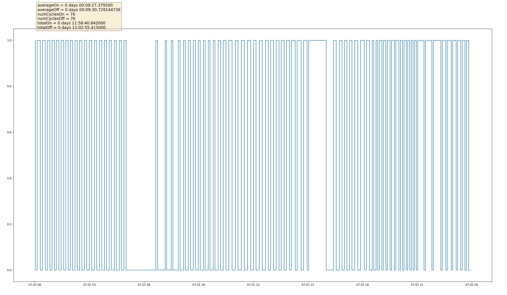

# NestData

Couple of Python scrips to parse Google Home history data from [Google Takeout](https://takeout.google.com/).

## How to use

1. Drop your `HomeHistory.json` in the root directory.
1. Run `python parse.py`, which will generate `cycles.csv` with data that contains when states change, and the duration of the state.
1. Adjust `startDate` and `endDate` in `chart.py` to adjust the displayed portion of the chart.
1. Run `python chart.py`, which will open up a chart (example below), with some other stats in the top left.
   
